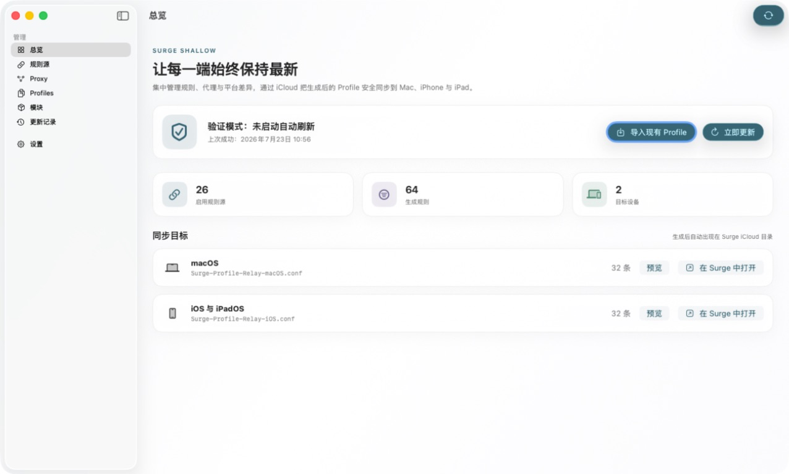
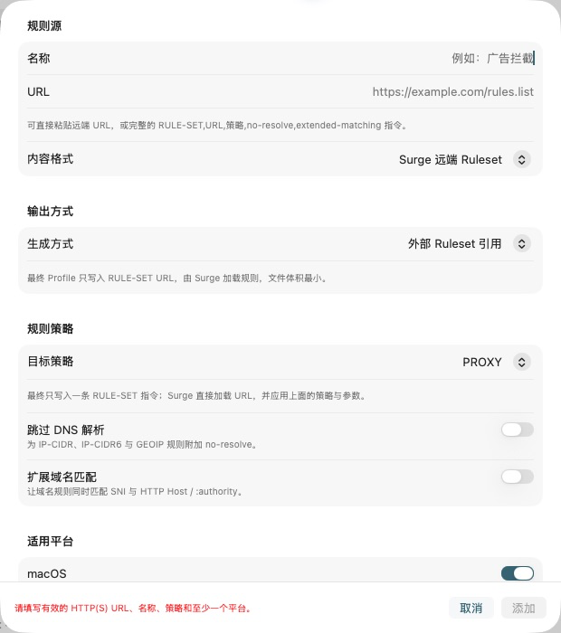

# Surge Shallow

Surge Shallow 是一个面向 macOS 26 的原生 SwiftUI 客户端，用来集中管理规则源、代理、平台差异与模块。兼容 Surge Ruleset 的来源默认以紧凑 `RULE-SET` URL 保留在最终 Profile 中；需要格式转换时，也可以下载、解析、排序、去重并内联输出。生成后的 macOS 与 iOS/iPadOS `.conf` 会原子写入 Surge 的 iCloud Documents 容器。

它解决的是“规则编排”而不是单一订阅：外部 Ruleset 由 Surge 直接加载，保持配置文件轻量；选择内联合并的来源则由 Mac 端按设定周期检查，验证通过才发布。其他 Mac、iPhone 和 iPad 通过 Surge 自己的 iCloud 配置同步获得最新文件。

## 软件截图

### 总览



### 紧凑外部 Ruleset



## 已实现能力

- 原生新增 Module 管理功能：集中管理 Surge `.sgmodule`、Loon `.plugin` / `.lpx` 与 Quantumult X Rewrite 来源，自动识别格式并通过内置 Script-Hub 引擎转换；它由 Surge Shallow 的主状态、主导航、主设置和菜单栏持有，不是把另一个 App 的窗口壳嵌入进来。
- 提供模块可视化编辑、参数发现、脚本与策略覆盖、自定义规则/MITM、冲突处理、图标抓取、按 iOS/macOS/tvOS/visionOS 独立启用与排序。
- 生成稳定的 `Surge-Relay.sgmodule` 及各平台合并模块，可选输出单个模块；支持 iCloud、本地缓存、私有 GitHub 发布和 Cloudflare 稳定地址。
- 模块管理内含可选的 Web 管理 PWA、Surge Ponte 服务端/客户端、网络与睡眠恢复、远端更新进度、诊断导出和首次启用设置；登录启动继续由 Surge Shallow 的全局设置唯一管理。
- 管理任意数量的 HTTP/HTTPS 规则 URL，支持启用/停用、优先级顺序、输出方式、更新频率和适用平台。
- 原生支持远端 Surge Ruleset URL：新来源默认使用“外部 Ruleset 引用”，最终只写入 `RULE-SET,URL,策略` 及 `no-resolve` / `extended-matching` 参数，不下载或展开规则正文；也可以主动切换为“下载并内联合并”。
- 一键导入现有 `.conf` / `.dconf`：先在本地解析并展示迁移摘要，再把 General、Proxy、Proxy Group、规则、FINAL、平台专属项和高级段转换为结构化管理配置；用户确认前不会写入，应用后也不会自动发布。
- 导入时，每条 HTTP(S) `RULE-SET` 会按原顺序保留为紧凑外部引用，分别保留 URL、策略、`no-resolve` 与 `extended-matching`；其他规则按相邻片段保存为可同步的内嵌规则源，避免改变规则优先级。
- 导入的内联规则直接保存在 `relay.json`，不会依赖当前 Mac 的临时文件；`#!include` 会保留并明确提示检查跨设备引用文件。LAN、SYSTEM 等 Surge 内建 Ruleset 不会被误当成远端 URL。
- 自动识别完整 Surge Profile、Surge 规则列表、纯域名列表和 Clash `payload`。
- 可统一改写策略，也可以保留上游策略并为缺少策略的规则补一个回退策略。
- 外部 Ruleset 按规则源顺序直接输出，不执行内容级合并或去重；选择内联合并时，相同匹配条件由排在前面的规则源获胜。
- 按 Surge 官方 Detached Profile Section 机制维护一份公共 `.dconf`；macOS 与 iOS/iPadOS 只保存平台差异、输出文件名和 `FINAL` 策略。
- 平台差异使用结构化表单管理：布尔项选择开启/关闭，枚举项使用选择器，端口、列表和文本使用输入框；也可添加自定义段、键和值，不再手写独立差异编辑器。
- 公共 `[General]` 也使用结构化表单管理，与平台差异共用同一套开关、枚举、端口、列表和自定义键值控件；平台差异只负责覆盖公共值。
- 独立的 Proxy Tab 集中管理公共 `[Proxy]` 与 `[Proxy Group]`：可选择官方协议或组类型，填写名称与参数，调整顺序，并保留自定义类型和原始行。
- 高级公共 Profile 编辑器只负责 `[Host]`、`[MITM]`、`[Script]`、Rewrite 等不适合简单表单化的公共段，并可插入段模板。
- `[General]`、`[Proxy]`、`[Proxy Group]`、`[MITM]`、`[Script]` 等同名公共段通过 `#!include` 复用；平台差异会追加在对应公共段之后。
- 两个平台的规则与 `FINAL` 完全相同时，共用公共 `[Rule]`；不同时分别生成，保持各自规则顺序和优先级。
- schema v1 中原有的两份完整基础 Profile 会自动抽取内容完全相同的段到公共配置；schema v2 的文本差异会自动迁移为结构化项目；schema v3 的公共文本 Profile 会继续拆分为 General、Proxy、Proxy Group 和其他公共段。未知键、注释、协议和指令仍会保留。
- 自动移除基础配置首行的 `#!MANAGED-CONFIG`，防止 Relay 产物重新被原远端配置覆盖。
- 内联合并来源使用 ETag 与 Last-Modified 条件请求；下载内容解析成功后才替换本地缓存。
- 首次下载失败时停止发布；已有缓存时允许以“使用最后成功版本”的警告状态发布。
- 先生成本地预览并做内置检查，再调用本机 `surge-cli --check`；所有启用目标通过后才写 iCloud。
- 使用 `Data.write(.atomic)`、`NSFileCoordinator` 和 iCloud 冲突检查，避免把半写文件同步到其他设备。
- 绝不覆盖没有 `# surge-profile-relay:managed` 所有权标记的同名文件。
- 提供为 macOS 26 重构的原生界面：以 Liquid Glass 承载导航与关键动作，以实体 Surface 承载高密度配置内容，并支持系统深浅色、降低透明度、提高对比度和减少动态效果。
- 支持“跟随系统 / 浅色 / 深色”三档外观；选择保存在本机，不会写入或同步 Surge 的 iCloud 管理配置。
- 提供侧边栏管理界面、菜单栏快捷面板、更新历史、启动检查、周期调度和登录启动选项。

## 同步结构

默认输出根目录：

```text
~/Library/Mobile Documents/iCloud~com~nssurge~inc/Documents/
├── Surge-Profile-Relay-macOS.conf
├── Surge-Profile-Relay-iOS.conf
├── Surge-Profile-Relay-Shared.dconf
├── Surge Profile Relay/  # 为兼容已有安装保留的管理目录名
│   ├── relay.json
│   └── relay.json.bak
├── Surge-Relay.sgmodule            # 模块总订阅（默认 iOS/iPadOS）
├── Surge-Relay-macos.sgmodule      # macOS 模块总订阅
└── Surge Relay/                    # 模块管理配置与同步状态
    ├── modules.json
    ├── settings.json
    ├── script-hub-state.json
    └── update-history.json
```

- 两个 `.conf` 位于 Surge 的 iCloud Documents 根目录，供 Surge 多端配置列表同步；它们按段引用同目录的公共 `.dconf`。
- `relay.json` 是规则源、排序、公共 Profile、平台差异和更新历史的管理清单，也会随 iCloud 到其他 Mac。
- 为确保升级后继续读取既有多端配置，`relay.json` 管理目录、Application Support 路径、UserDefaults 键和所有权标记仍沿用 `Surge Profile Relay` 兼容标识；这些不是当前应用显示名称。
- 上游正文缓存只保存在当前 Mac 的 `~/Library/Application Support/Surge Profile Relay/Cache/`，不会让大量派生数据进入 iCloud。

如果系统没有检测到 Surge iCloud 容器，可以在设置中选择任意 iCloud Drive 文件夹。此时 iOS 端可从“文件”App 导入生成的 `.conf`，但能否直接显示在 Surge 配置列表取决于所选目录。

## 为什么仍保留内联合并模式

默认外部 Ruleset 引用最适合减小 Profile 体积，并让 Surge 直接加载上游。以下场景仍可为特定来源选择“下载并内联合并”：

1. 需要转换 Clash payload、纯域名列表或完整 Surge Profile；
2. 上游规则自带策略，并且需要逐条保留或统一改写；
3. 需要在多个来源之间执行内容级去重；
4. 希望最终 Profile 固化一份当前已验证的规则正文；
5. 上游失败时必须使用本机最后成功缓存继续发布；
6. 发布前需要由 Surge Shallow 下载并确认上游正文可以解析。

Surge Managed Profile 的自动更新还要求 Surge 主程序正在运行；Relay 的检查周期由自己的菜单栏进程负责。

## 构建与运行

要求：macOS 26、Xcode 26 / Swift 6.2 或更高版本。建议已安装 Surge Mac，以启用真实 CLI 校验。

开发运行：

```bash
swift run SurgeShallow
```

也可以在 Xcode 中直接打开仓库根目录的 `Package.swift`。

生成可双击的 ad-hoc 签名应用：

```bash
chmod +x scripts/package_app.sh
./scripts/package_app.sh
open "build/Surge Shallow.app"
```

产物位于 `build/Surge Shallow.app`。如需长期分发或可靠使用“登录时启动”，请用自己的 Developer ID 对应用签名并完成 Apple notarization。

App Icon 的 1024×1024 母版位于 `Assets/AppIcon/AppIcon-1024.png`，完整 ICNS 由 `scripts/build_app_icon.sh` 生成；单一折带符号抽象表达 Profile 合并与双向 Relay。

## 使用流程

1. 已有 Surge Profile 时，从总览或 Profiles 点击“导入现有 Profile”，选择适用平台并检查识别摘要与警告；确认应用后再到各页面复核。没有现有配置时可跳过此步。
2. 打开 Profiles 页面，通过“添加通用选项”配置两端共同使用的 General 项；高级公共段继续在下方编辑器中维护。
3. 打开 Proxy 页面，添加公共 Proxy 和 Proxy Group，填写名称、协议或组类型及其参数。
4. 回到 Profiles，在 macOS 与 iOS/iPadOS 卡片中通过“添加差异项”选择覆盖项或平台专属项；没有差异时保持空列表即可完整继承公共配置。
5. 确认公共 `.dconf` 与两个输出 `.conf` 的文件名不会和手工维护的文件重名。
6. 在规则源页面按期望优先级添加规则 URL，选择目标策略与平台；Surge Ruleset 默认保持为紧凑外部引用，也可切换为内联合并。远端 Ruleset 可启用 `no-resolve` 与 `extended-matching`，从旧 Profile 导入的普通规则会显示为“内嵌于管理配置”。
7. 点击“立即更新并合并”。
8. 在总览中确认 Surge CLI 校验结果、规则数和去重数。
9. 在 Surge 的配置列表中选择生成文件；其他设备等待 iCloud 完成同步即可。

模块管理可直接打开侧边栏“模块”：首次进入会在当前功能内引导选择 iCloud 或私有 GitHub 存储。模块列表和详情直接使用 Surge Shallow 的主导航详情区；添加 Surge/Loon/Quantumult X 模块 URL 后，可配置参数、脚本、策略、规则和 MITM 覆盖，再复制稳定总订阅地址到其他 Surge 设备。模块专属配置统一从 Surge Shallow 的“设置 → 模块管理”进入，Web 管理和 Surge Ponte 作为其中的高级能力提供。

规则源排在越前面，冲突时优先级越高。上游中的 `FINAL` 会被忽略，最终策略由目标 Profile 统一管理。
首次启动且没有规则源时，应用不会自动创建或覆盖任何 `.conf`；添加规则源后，“应用启动时检查”才会开始生效。

## 安全与隐私

- 规则源 URL 可能包含订阅密钥；管理清单会保存在用户自己的 Surge iCloud 容器中，请勿把 `relay.json` 上传到公开仓库。
- 本应用不代理网络流量、不读取 Surge 运行日志，也不会修改 Surge 当前运行状态。
- `surge-cli` 仅以 `--check <临时预览文件>` 方式调用，不执行 `set`、`reload` 或 `switch-profile`。
- 应用当前不启用 App Sandbox，因为它需要写入 Surge 已有的 iCloud Documents 容器。若准备上架 Mac App Store，应改用用户选择目录的 security-scoped bookmark 工作流，不能声明第三方 iCloud container entitlement。

## 验证

```bash
swift test
/Applications/Surge.app/Contents/Applications/surge-cli --check Examples/base-macOS.conf
```

测试覆盖外部 Ruleset 紧凑输出、跳过正文下载、内联合并与去重、规则格式、策略处理、逻辑规则、平台过滤、Detached Profile 共享、平台差异叠加、旧 schema 迁移、完整 Profile 导入分类、内嵌规则、多个 FINAL、未知段、无 Rule 与无效 UTF-8、真实 `surge-cli` 检查、FINAL 门禁、缓存回退、发布门禁和非 Relay 文件防覆盖。

## 致谢

特别感谢 [EEliberto/SurgeRelay-macOS](https://github.com/EEliberto/SurgeRelay-macOS) 项目及其作者公开的源码与设计积累。Surge Shallow 2.1 的原生模块管理能力在遵守 Apache License 2.0 的前提下，基于该项目的模块转换、编辑、合并、发布、Web/Ponte 管理与同步实现进行整合和适配；同时保留 Surge Shallow 自己的单一应用生命周期、导航与设置体系。

## 参考与许可

- [Surge Profile 文档](https://manual.nssurge.com/overview/configuration.html)
- [Surge Ruleset 文档](https://manual.nssurge.com/rule/ruleset.html)
- [EEliberto/SurgeRelay-macOS](https://github.com/EEliberto/SurgeRelay-macOS)

本项目使用 MIT License。第三方参考和商标说明见 [THIRD_PARTY_NOTICES.md](THIRD_PARTY_NOTICES.md)。
