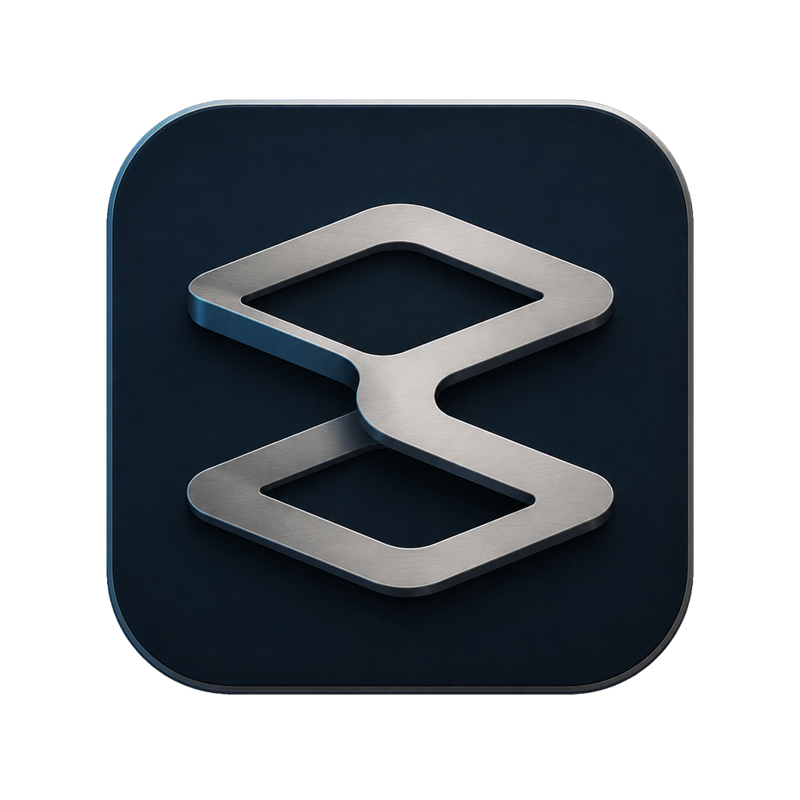
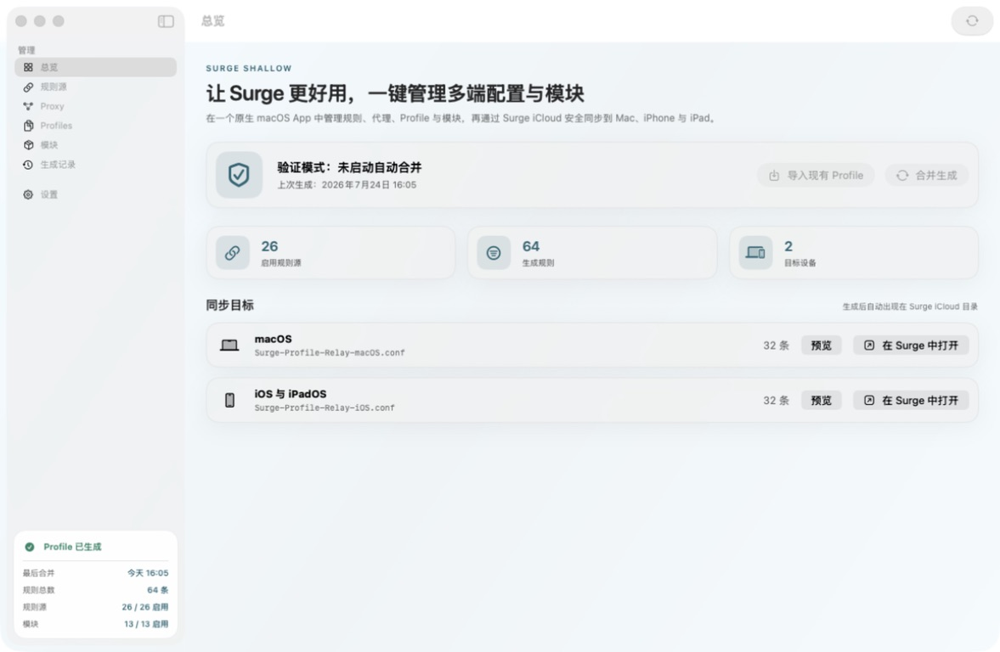
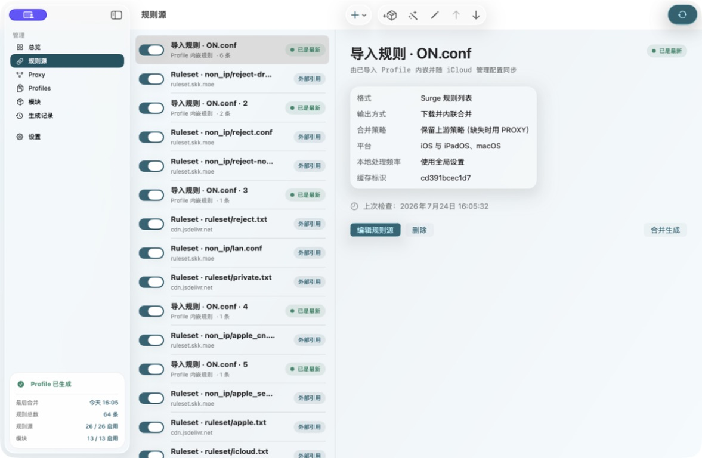
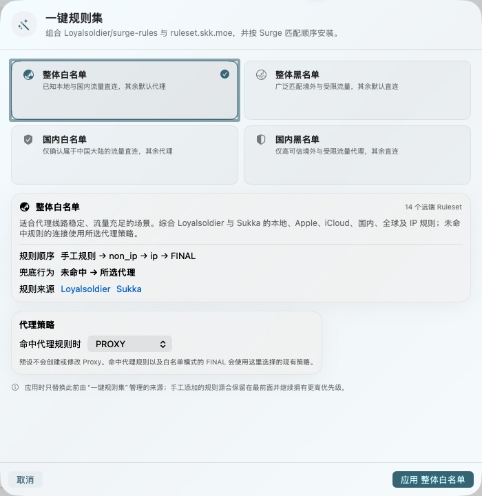
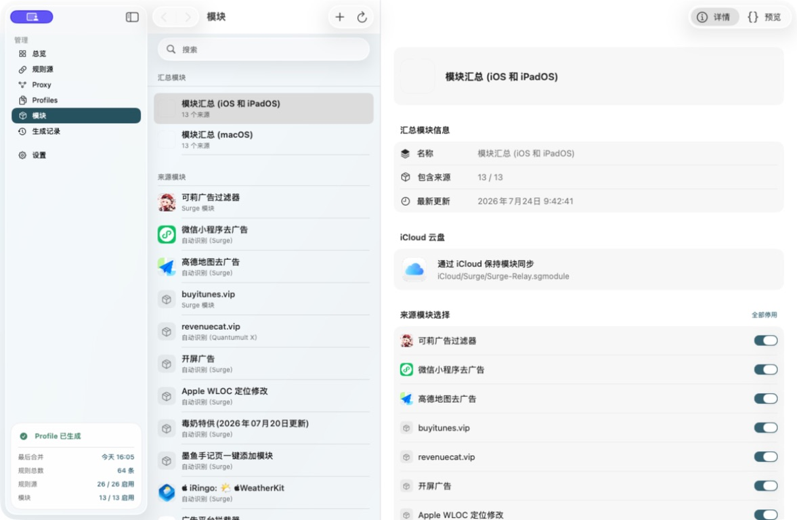
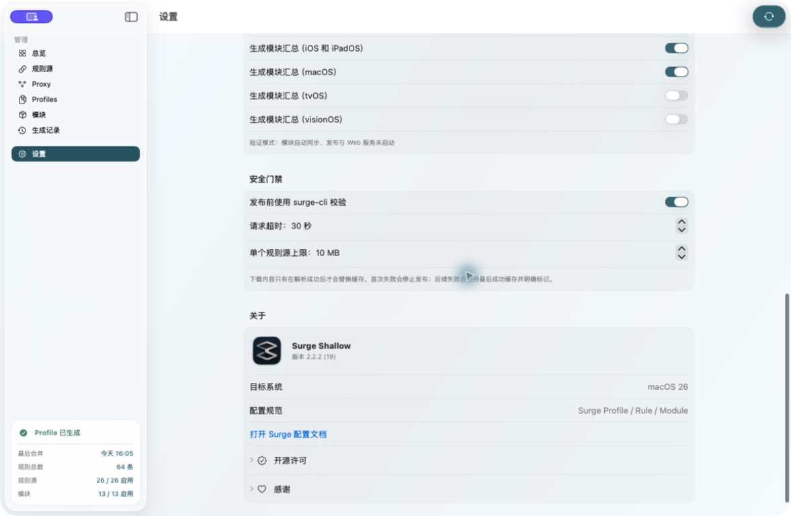

<p align="center">
  
</p>

<h1 align="center">Surge Shallow</h1>

<p align="center"><strong>让 Surge 更好用，一键管理多端配置与模块</strong></p>

<p align="center">
  Surge Shallow 是一款面向 macOS 26 的原生配置管理工具，把 Ruleset、Proxy、Profile、Module 与多端差异收进一个界面，再安全生成到 Surge iCloud。
</p>

<p align="center">
  <a href="https://github.com/funnythingfunnylove/Surge-Shallow/releases/latest"></a>
  
  
  <a href="LICENSE"></a>
</p>

<p align="center">
  <a href="https://github.com/funnythingfunnylove/Surge-Shallow/releases/latest/download/Surge-Shallow-2.2.2-macOS.zip"><strong>下载 Surge Shallow 2.2.2</strong></a>
  ·
  <a href="#三步开始使用">三步开始使用</a>
  ·
  <a href="#从源码构建">从源码构建</a>
</p>

> [!IMPORTANT]
> 当前版本需要 macOS 26 或更高版本。建议安装 Surge Mac，以启用发布前真实 `surge-cli --check` 校验。



## 一眼看懂

Surge Shallow 不是又一个订阅转换器，而是 Profile 与 Module 的统一控制台：

| 你要管理的内容 | Surge Shallow 会做什么 | 最终产物 |
| --- | --- | --- |
| Ruleset 与手工规则 | 排序、平台过滤、策略编排；远端 Surge Ruleset 保持轻量 URL 引用，需要转换的来源才在本机处理 | `[Rule]`、独立规则 `.dconf` |
| Proxy 与 Profile | 结构化维护 General、Proxy、Proxy Group、公共段和平台差异 | 公共 `.dconf` + macOS / iOS `.conf` |
| Surge / Loon / Quantumult X 模块 | 自动识别、转换、可视化编辑、合并并按平台启停 | `.sgmodule` 与平台汇总模块 |
| 多端同步 | 原子写入 Surge iCloud，并在覆盖前验证所有权与配置有效性 | Mac、iPhone、iPad 共用的配置与模块 |

## 页面展示

<table>
  <tr>
    <td width="50%" valign="top">
      <strong>规则源</strong><br>
      外部 Ruleset、Profile 内嵌规则和手工规则统一排序；状态、平台、策略与输出方式一眼可见。
      <br><br>
      
    </td>
    <td width="50%" valign="top">
      <strong>一键规则集</strong><br>
      四种白名单 / 黑名单方案组合 Loyalsoldier 与 Sukka，并保留用户手工规则的最高优先级。
      <br><br>
      
    </td>
  </tr>
  <tr>
    <td width="50%" valign="top">
      <strong>模块管理</strong><br>
      在同一个 App 中管理来源模块、iOS / macOS 汇总、参数覆盖、预览、更新与发布。
      <br><br>
      
    </td>
    <td width="50%" valign="top">
      <strong>统一设置</strong><br>
      Profile、Module、软件更新、安全门禁、开源许可和感谢都归入 Surge Shallow 的单一设置体系。
      <br><br>
      
    </td>
  </tr>
</table>

## 三步开始使用

1. 从 [Latest Release](https://github.com/funnythingfunnylove/Surge-Shallow/releases/latest) 下载 ZIP，解压后把 `Surge Shallow.app` 移入 `/Applications`。
2. 第一次打开时，可以导入现有 `.conf` / `.dconf`；应用会先展示识别摘要，确认前不会写入配置，应用后也不会自动发布。
3. 添加规则源或选择“一键规则集”，按需配置 Proxy、平台差异与模块，然后点击“合并生成”。通过校验后，产物会写入 Surge iCloud 并同步到其他设备。

### macOS 提示无法打开时

Release 当前使用 ad-hoc 代码签名，尚未经过 Apple notarization。如果 macOS 因下载隔离属性阻止启动，请先确认 ZIP 来自本仓库的 [正式 Release](https://github.com/funnythingfunnylove/Surge-Shallow/releases/latest)，并核对 Release 页面提供的 SHA-256；确认无误后，在终端中只对这个 App 执行：

```bash
sudo xattr -rd com.apple.quarantine "/Applications/Surge Shallow.app"
```

输入的是当前 Mac 的管理员密码，终端不会显示密码字符。该命令只移除 `Surge Shallow.app` 的下载隔离属性；不要把路径改成整个 `/Applications` 或下载目录。Surge Shallow 自身运行时不需要管理员权限。

### 生成流程

```text
规则源 / 手工规则 ─┐
Proxy / Proxy Group ├─→ 本地预览与内置检查 ─→ surge-cli 校验 ─→ 原子写入 Surge iCloud
公共 Profile / 差异 ┤                                           ├─→ macOS Profile
模块与平台开关 ─────┘                                           ├─→ iOS / iPadOS Profile
                                                               └─→ 多平台模块汇总
```

## 核心能力

### 一键管理规则与 Profile

- 提供整体白名单、整体黑名单、国内白名单、国内黑名单四种一键规则集；按 `手工规则 → non_ip → ip → FINAL` 安装，并复用现有 Proxy 或策略组。
- 原生 Surge Ruleset 只保存 URL、策略和 `no-resolve` / `extended-matching` 参数，由 Surge 自行加载，不会被错误地定时下载或展开。
- 支持直接编写手工规则，可选择合并进 `[Rule]`，也可生成独立、带所有权保护的规则 `.dconf`。
- 支持 GitHub 仓库批量导入，以及完整 Surge Profile、规则列表、域名列表和 Clash `payload` 自动识别。
- 一键导入现有 Profile，并把 General、Proxy、Proxy Group、规则、FINAL、平台专属项和高级段迁移为结构化配置。
- 公共 Detached Profile 与 macOS / iOS 差异分开维护；相同段只维护一次，真正不同的值才留在平台 Profile。

### 原生管理模块

- 支持 Surge `.sgmodule`、Loon `.plugin` / `.lpx` 与 Quantumult X Rewrite，自动识别并通过内置 Script Hub 引擎转换。
- 提供参数发现、脚本与策略覆盖、自定义 Rule / MITM、冲突处理、图标抓取和可编辑预览。
- 模块可以按 iOS / iPadOS、macOS、tvOS、visionOS 独立启用、排序并生成汇总。
- 支持 iCloud、本地缓存、私有 GitHub 发布与 Cloudflare 稳定地址；可选 Web 管理和 Surge Ponte 远程管理。
- Module 是 Surge Shallow 的原生功能：共用主进程、导航、设置、菜单栏与运行时，不是把另一个 App 嵌入窗口。

### 安全生成与更新

- 下载内容只有在解析成功后才替换缓存；首次失败停止发布，已有缓存时可以明确标记并沿用最后成功版本。
- 发布前先完成内置检查，再调用本机 `surge-cli --check`；所有启用目标都通过后才写入 iCloud。
- 使用原子写入、`NSFileCoordinator`、iCloud 冲突检查和最后成功版本保护。
- 不覆盖缺少 `# surge-profile-relay:managed` 所有权标记的同名 Profile，也不覆盖不属于当前手工规则源的 `.dconf`。
- 内置更新器从 GitHub Release 下载 ZIP，并校验 GitHub SHA-256、Bundle ID、版本号、代码签名和旧进程身份；异常时回滚，不覆盖仍在运行的 App。

## 同步结构

```text
Surge iCloud Documents/
├── Surge-Profile-Relay-Shared.dconf
├── Surge-Profile-Relay-macOS.conf
├── Surge-Profile-Relay-iOS.conf
├── Surge Profile Relay/
│   ├── relay.json
│   └── relay.json.bak
├── Surge-Relay.sgmodule
├── Surge-Relay-macos.sgmodule
└── Surge Relay/
    ├── modules.json
    ├── settings.json
    ├── script-hub-state.json
    └── update-history.json
```

- `.conf`、`.dconf` 与汇总 `.sgmodule` 位于 Surge iCloud Documents，供各设备直接使用。
- `relay.json` 保存规则排序、公共 Profile、平台差异和生成记录；Module 配置保留在兼容的 `Surge Relay` 目录。
- 下载缓存与预览仅保存在当前 Mac 的 Application Support，不把大量派生数据同步到 iCloud。
- 如果系统没有检测到 Surge iCloud 容器，可以在设置中选择其他 iCloud Drive 文件夹。

## 从源码构建

要求：macOS 26、Xcode 26 / Swift 6.2 或更高版本。

```bash
git clone https://github.com/funnythingfunnylove/Surge-Shallow.git
cd Surge-Shallow
swift test
./scripts/package_app.sh
open "build/Surge Shallow.app"
```

也可以在 Xcode 中直接打开根目录的 `Package.swift`。打包脚本会生成 ad-hoc 签名的 `build/Surge Shallow.app`；长期分发请使用自己的 Developer ID 并完成 Apple notarization。

## 安全与隐私

- 规则源或模块 URL 可能包含订阅密钥。请勿把真实 `relay.json`、`modules.json` 或 `settings.json` 上传到公开仓库。
- Surge Shallow 不代理网络流量、不读取 Surge 运行日志，也不会切换或重载当前 Profile。
- `surge-cli` 只以 `--check <临时预览文件>` 方式运行，不调用 `set`、`reload` 或 `switch-profile`。
- 当前版本不启用 App Sandbox，因为需要写入 Surge 已有的 iCloud Documents 容器。

## 验证

```bash
swift test
swift build -c release -Xswiftc -warnings-as-errors
./scripts/package_app.sh
codesign --verify --deep --strict --verbose=2 "build/Surge Shallow.app"
```

测试覆盖规则解析与顺序、外部 Ruleset 轻量引用、手工规则与独立 `.dconf`、一键规则集、平台差异、Profile 导入、模块转换与合并、缓存回退、iCloud 冲突、所有权门禁和软件更新器进程保护。

## 致谢与许可

Surge Shallow 使用 [MIT License](LICENSE)。第三方参考、商标与许可证说明见 [THIRD_PARTY_NOTICES.md](THIRD_PARTY_NOTICES.md)。

特别感谢 [EEliberto/SurgeRelay-macOS](https://github.com/EEliberto/SurgeRelay-macOS) 项目及其作者公开的源码与设计积累。原生模块管理在遵守 Apache License 2.0 的前提下整合其模块转换、编辑、合并、发布、Web / Ponte 管理与同步能力，同时保留 Surge Shallow 自己的单一应用生命周期与设置体系。

规则集与实现参考：

- [Surge Profile 文档](https://manual.nssurge.com/overview/configuration.html)
- [Surge Ruleset 文档](https://manual.nssurge.com/rule/ruleset.html)
- [Loyalsoldier/surge-rules](https://github.com/Loyalsoldier/surge-rules)
- [Sukka Ruleset](https://ruleset.skk.moe)
- [Script Hub](https://github.com/Script-Hub-Org)

“Surge”是其权利人的产品名称，本项目仅用于描述兼容性，与 Surge Networks Inc. 无隶属关系。
